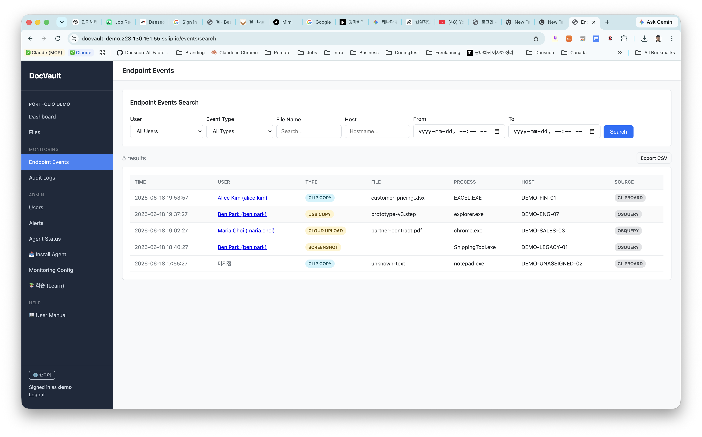
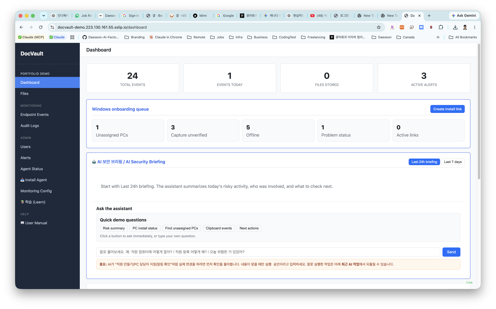
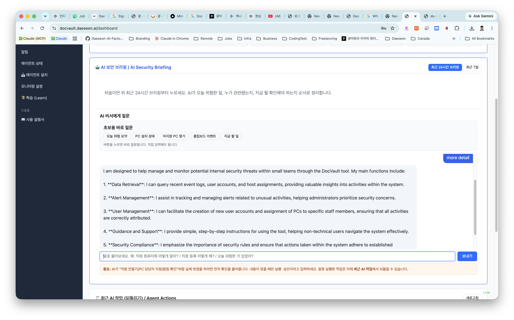
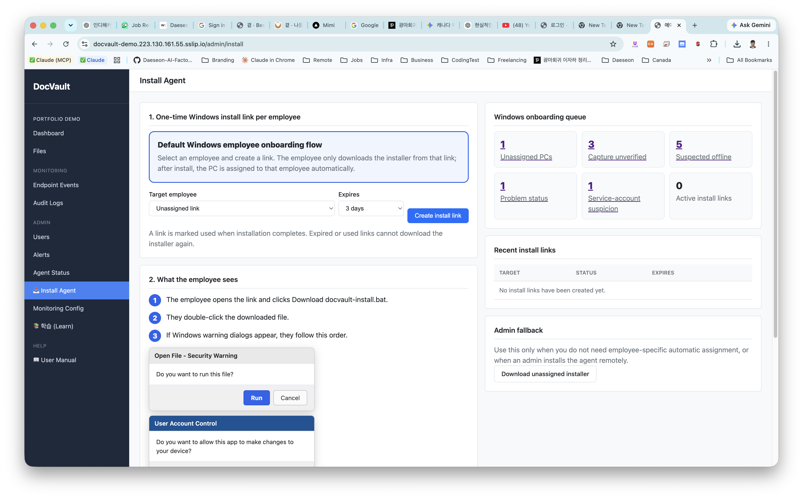
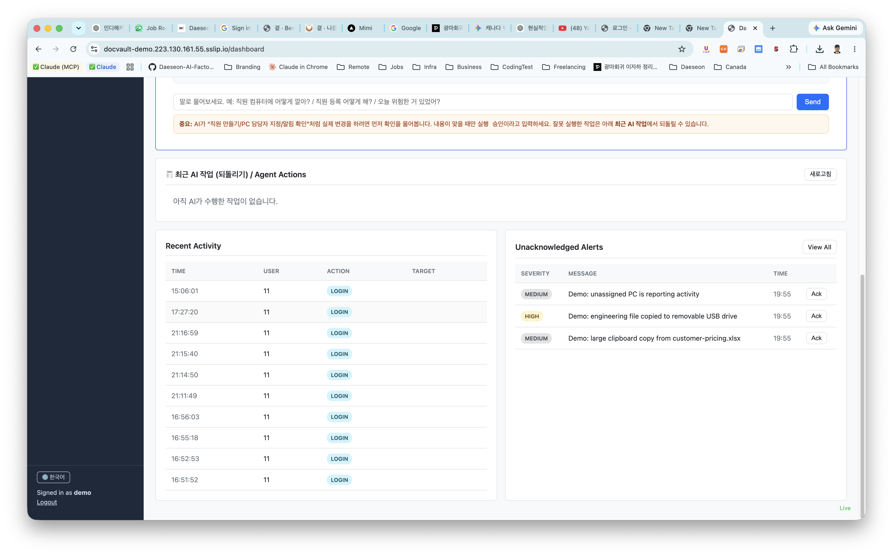
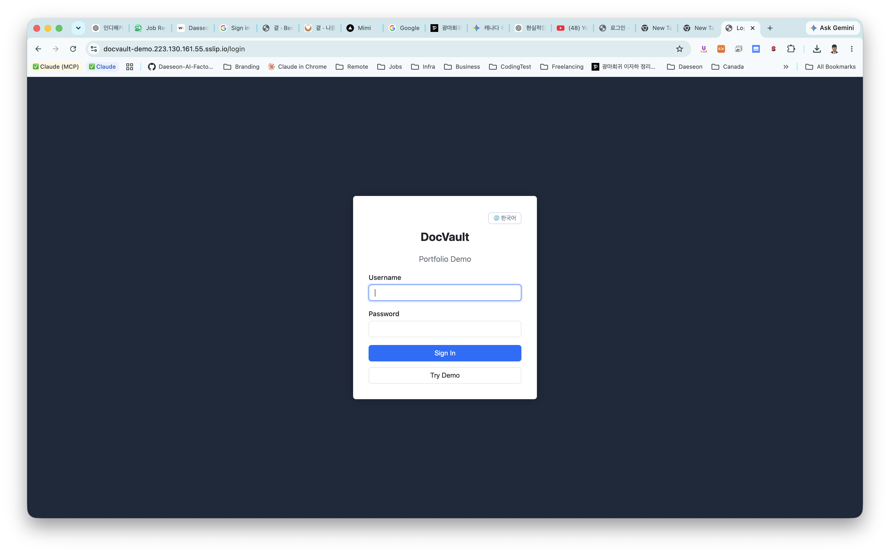

# DocVault


**Self-hosted insider-threat monitoring for small teams.** osquery and a custom Go agent collect endpoint activity (file access, clipboard, USB, messenger/email file leaks) from employee PCs; the server stores it in PostgreSQL and surfaces it through an htmx web UI. A DB-trigger **hash chain** makes audit logs tamper-evident, and threshold rules flag risky patterns like after-hours access or bulk downloads.

Built solo, full-stack — **no external infra: just Go and PostgreSQL** (no Redis, Kafka, or message queue).

🔗 **[Live demo](http://docvault-demo.223.130.161.55.sslip.io/login)** · seeded login `admin / admin1234!`

<br/>

**Endpoint events** — who copied what, where, on which host (clipboard / USB / cloud upload / screenshot), searchable + CSV export.


**Dashboard** — event stats, onboarding queue, AI security briefing, and unacknowledged alerts in one view.


**AI security assistant** — answers from live DB data via tool calls; action tools need approval and are rollback-able.


<details>
<summary><b>More screenshots</b> — agent install, activity feed &amp; alerts, login (password + TOTP 2FA)</summary>





</details>

---

## Engineering Highlights

The parts worth reading the code for:

- **Streaming AES-256 envelope encryption** — per-file keys wrapped by a master key; files are encrypted/decrypted with `io.Copy` and never fully buffered in memory, so a 500 MB upload uses constant memory. ([`internal/vault`](internal/vault))
- **Tamper-evident audit log via a Postgres hash chain** — an `INSERT` trigger links each row's `prev_hash` to the previous row's `row_hash`; `UPDATE`/`DELETE` are blocked. A `/api/audit/verify` endpoint walks the chain to detect application-level tampering. ([`internal/audit`](internal/audit), migration `008`)
- **LLM assistant with raw function-calling — no SDK** — one provider-agnostic tool-use loop over OpenAI / Gemini / Anthropic. Read tools run immediately; mutating tools (create user, assign host) are gated behind explicit approval and are **rollback-able** via a recorded `prev_state`. Prompt-injection from collected data is explicitly refused. ([`internal/agent`](internal/agent))
- **Dynamic osquery config from the database** — monitored process groups, sensitive extensions, and watch paths live in DB tables, so the osquery schedule queries are generated at runtime instead of hardcoded. ([`internal/endpoint`](internal/endpoint), [`internal/monitoring`](internal/monitoring))
- **Resilient endpoint agent** — bounded in-memory queue buffers events when the server is down, with exponential-backoff retry and periodic re-enrollment to survive restarts and IP changes. ([`cmd/clipagent`](cmd/clipagent))

**By the numbers:** ~14.4k lines of Go · 127 tests across 28 files · 15 internal packages · 18 DB migrations · 18 endpoint event types · 10 anomaly rules.

---

## How it works

```
Employee PC                      Server (Go)                    Stores
┌────────────────┐   HTTPS   ┌──────────────────────┐
│ osquery        │──────────▶│ ingest → normalize    │──▶ PostgreSQL
│ clipboard agent│  (PSK)    │   ├─ alert rule engine │     (hash-chained
└────────────────┘           │   ├─ UEBA scoring      │      audit log)
                             │   ├─ file-hash tracker │
Admin / Employee   JWT+2FA   │   └─ SSE → dashboard   │──▶ encrypted vault
  (htmx web UI) ◀────────────│ vault · audit · agent  │     (AES-256, on disk)
                             └──────────────────────┘
```

Full data flow and design rationale: [Architecture](docs/ARCHITECTURE.md) · [Decisions / ADRs](docs/DECISIONS.md)

## Tech stack

**Go 1.22** · **PostgreSQL 16** · chi (routing) · pgx (driver) · htmx + Go `html/template` (UI) · osquery 5.x (endpoint agent) · JWT + bcrypt + TOTP (auth) · AES-256 (envelope encryption) · Docker

## Run locally

```bash
make build                         # → bin/docvault

createdb docvault
./bin/docvault migrate             # apply 18 migrations
./bin/docvault seed                # create admin / admin1234!
./bin/docvault serve               # http://localhost:8080
```

```bash
# required env
DOCVAULT_DB_URL=postgres://localhost/docvault
DOCVAULT_MASTER_KEY=<hex-encoded 32 bytes>
DOCVAULT_JWT_SECRET=<random string>
DOCVAULT_OSQUERY_PSK=<pre-shared key>
# optional: enables the AI assistant / briefing
DOCVAULT_OPENAI_API_KEY=...   # or DOCVAULT_GEMINI_API_KEY / DOCVAULT_ANTHROPIC_API_KEY
```

Endpoint agents (optional): `make clipagent-windows` / `make clipagent-darwin`, and copy `deploy/osquery/*` to the osquery config dir.

## Tests

```bash
make test-all      # build + vet + tests (127 tests, 28 files)
make ci            # same as CI
```

## Project layout

```
cmd/server        entrypoint (serve / migrate / seed)
cmd/clipagent     Windows/macOS clipboard agent
internal/auth     JWT, bcrypt, TOTP, middleware
internal/vault    streaming encryption, storage, key management
internal/audit    auto-logging middleware, hash-chain verification
internal/endpoint osquery + clipboard ingestion, normalization
internal/alert    rule engine, Slack notifier
internal/ueba     threshold-based anomaly scoring
internal/agent    LLM assistant (tool-use + rollback)
internal/web      router, SSE, CSRF, templates
deploy/           osquery, nginx, systemd, backup
```

## What this is **not**

Stated up front, because scope honesty matters:

- **Not DRM.** It detects, it does not block.
- **Not ML-based UEBA.** 10 threshold rules with weighted scoring — no machine learning.
- **Not legal-grade evidence.** The hash chain catches application-level tampering, but a DB superuser can still bypass it.
- **Not a production security product.** A portfolio project — no certification, support, or SLA.

Full known limitations: [docs/LIMITATIONS.md](docs/LIMITATIONS.md).

## Notes

Personal portfolio project (2026). Developed with AI assistance; the core modules — the hash-chain trigger, the clipboard agent, and the envelope encryption — were written and are understood by me, and I can walk through any of them.

한국어 설명은 [docs/](docs/) 디렉터리를 참고하세요.

## License

MIT
